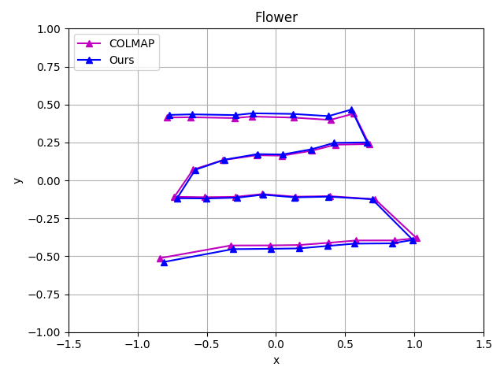

# SiNeRF: Sinusoidal Neural Radiance Fields for Joint Pose Estimation and Scene Reconstruction

**[arXiv](http://arxiv.org/abs/2210.04553) | [BMCV2022](todo)**

[Yitong Xia¹](https://github.com/yitongx), [Hao Tang¹](http://disi.unitn.it/~hao.tang/), [Radu Timofte¹² ](http://people.ee.ethz.ch/~timofter/), [Luc Van Gool¹](https://scholar.google.com/citations?user=TwMib_QAAAAJ&hl=zh-CN)

[¹CVL, D-ITET, ETH Zürich](https://vision.ee.ethz.ch/)<br>
[²CVL, CAIDAS, University of Würzburg](https://www.informatik.uni-wuerzburg.de/computervision/team/)

## 0. Environment
Please set environment and codes with the following commandlines:
```Python
conda create -n sinerf python=3.8.12
conda activate sinerf
pip install -r requirements.txt

git clone https://github.com/yitongx/sinerf.git
cd nerfmm
```

## 1. Prepare Data
The original LLFF dataset can be downloaded from [here](https://drive.google.com/drive/folders/128yBriW1IG_3NJ5Rp7APSTZsJqdJdfc1). SiNeRF uses the [refined version](https://www.robots.ox.ac.uk/~ryan/nerfmm2021/nerfmm_release_data.tar.gz) provided by [NeRFmm](https://github.com/ActiveVisionLab/nerfmm). Please download the data with the following commandlines: 
```
wget https://www.robots.ox.ac.uk/~ryan/nerfmm2021/nerfmm_release_data.tar.gz
tar -xzvf nerfmm_release_data.tar.gz
```

## 2. Training and Evaluating
We provide `train_eval_sinerf.py` for training SiNeRF and evaluating test results. Please run the following commandlines: 

    python tasks/nerfmm/train_eval_sinerf.py \
    --base_dir [BASE_DIR] \  # e.g., ./data/LLFF/
    --root_dir [ROOT_DIR] \  # e.g., ./outputs/sinerf
    --scene_name [SCENE] \   # [fern, flower, fortress, horns, leaves, orchids, room, trex]
    --model_type "sinerf" \  # [sinerf, official]
    --hidden_dims 256 \
    --pos_enc_levels 0 \    # [0, 10]
    --dir_enc_levels 0 \    # [0, 4]
    --epoch 10000 \
    --use_ROI \
    --ROI_schedule_head 0.0 \
    --ROI_schedule_tail [T_R] \
    --alias ""
where
- `base_dir`: where you store the dataset.
- `root_dir`: where you wish to save outputs. Use `--alias` argument to further specify this directory's name. A task directory `root_dir/[TASK_NAME]/` will be automatically created.
- `model_type`: you can choose either using SiNeRF or the official NeRFmm baseline. 
- `pos_enc_levels` and `dir_enc_levels`": The Positional Encoding (PE) level for position $\textbf{x}$ and direction $d$. For SiNeRF both `pos_enc_levels` and `dir_enc_levels` are set to 0, i.e. no PE for input.
- `use_ROI`: whether to use Mixed Region Sampling in Section 3.4 in [paper](http://arxiv.org/abs/2210.04553).
- `ROI_schedule_head`: starting time of MRS, float value ranges from 0 to 1. Set to 0 as default.
- `ROI_schedule_tail`: ending time of MRS, float value ranges from 0 to 1. Set to 0.05 for $\textit{Fortress}$ and $\textit{Trex}$ and 0.005 for the rest. You are also encouraged to try different values along with different random seeds to reproduce the results in the paper.
 
The model checkpoints will be saved in `[ROOT_DIR]/[TASK_NAME]/` directory. The evaluation results will be saved in `[ROOT_DIR]/[TASK_NAME]/render_eval/` directory.


## 3. Visualizing
### Plotting Pose Trajectory
To plot the aligned camera trajectories between COLMAP and your poses, as the one in Figure 2, please run the following commandlines:
```
python tasks/nerfmm/vis_learned_poses.py \
--base_dir [BASE_DIR] \
--scene_name [SCENE] \
--ckpt_dir [ROOT_DIR/CKPT_DIR]
```
And get an image like this:
<p align="center">
    
</p>

### Generating Spiral Video
To produce the spiral-like RGB and depth videos, please run the following commandlines:
```
python tasks/nerfmm/spiral_sinerf.py \
--base_dir [BASE_DIR] \
--scene_name [SCENE] \
--model_type "sinerf" \
--pos_enc_levels 0 \
--dir_enc_levels 0 \
--ckpt_dir [ROOT_DIR/CKPT_DIR]
```
And get a MP4 video clip like this after concatenating:
<p align="center">
    
</p>


## Acknowledgement
This work is done by Yitong Xia during his semester project at Computer Vision Laboratory (CVL), D-ITET, ETH Zürich, under the instruction of Dr. Hao Tang, Prof. Radu Timofte, and Prof. Luc Van Gool.

This work is an improvement upon [NeRFmm](https://github.com/ActiveVisionLab/nerfmm), to which we reference the codes and experimental settings.

## Citation
If you find our paper or repository useful, please cite `BibTeX` as: 
```
@article{xia2022sinerf,
  title={SiNeRF: Sinusoidal Neural Radiance Fields for Joint Pose Estimation and Scene Reconstruction},
  author={Xia, Yitong and Tang, Hao and Timofte, Radu and Van Gool, Luc},
  journal={arXiv preprint arXiv:2210.04553},
  year={2022}
}
```